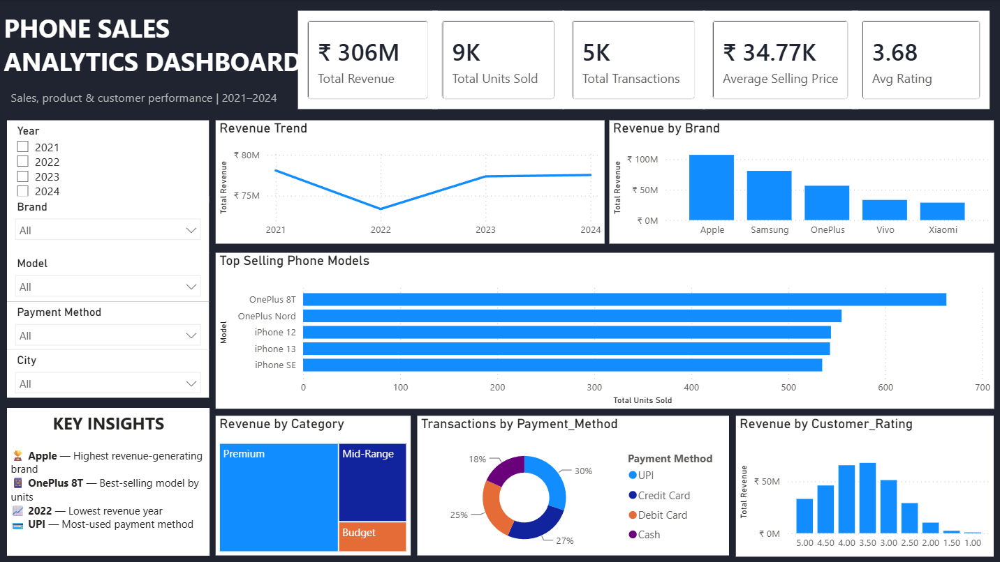

# 📱 Phone Sales Analytics Dashboard — Power BI

## 📊 Project Overview

This project is an interactive Power BI dashboard designed to analyze phone sales performance from 2021 to 2024. The dashboard provides insights into revenue, units sold, transactions, product performance, customer ratings, payment methods, and sales categories.

The goal of the project is to transform raw sales data into an interactive business intelligence dashboard that can help identify sales trends, top-performing products, and customer behavior.

## 🎯 Project Objectives

- Analyze overall phone sales and revenue performance.
- Track revenue trends across different years.
- Identify the highest revenue-generating brands.
- Identify the best-selling phone models based on units sold.
- Analyze revenue contribution by product category.
- Understand customer payment preferences.
- Analyze revenue distribution across customer ratings.
- Provide interactive filtering for business analysis.

## 🗂️ Dataset

The project uses three CSV datasets:

- **Fact_Sales.csv** — Contains sales transaction information such as revenue, units sold, payment method, customer rating, and product details.
- **Dim_Product.csv** — Contains product information such as brand, model, category, and product ID.
- **Dim_Customer.csv** — Contains customer-related information such as customer ID and city.

The datasets were structured into fact and dimension tables to create a simple analytical data model.

## 🔗 Data Modeling

The Power BI model follows a dimensional modeling approach using:

- Fact table — Sales transactions
- Product dimension
- Customer dimension

Relationships between the tables allow sales data to be analyzed across different products, brands, customers, cities, and categories.

## 📈 Dashboard Features

### KPI Cards

The dashboard includes key performance indicators for:

- Total Revenue
- Total Units Sold
- Total Transactions
- Average Selling Price
- Average Customer Rating

### Interactive Filters

Users can filter the dashboard by:

- Year
- Brand
- Model
- Payment Method
- City

### Visualizations

The dashboard contains:

- Revenue Trend by Year
- Revenue by Brand
- Top-Selling Phone Models
- Revenue by Category
- Transactions by Payment Method
- Revenue by Customer Rating

### Key Insights

The dashboard highlights important findings such as:

- Apple generates the highest revenue among the brands.
- OnePlus 8T is the best-selling model based on units sold.
- 2022 recorded the lowest revenue during the analyzed period.
- UPI is the most frequently used payment method.
- Premium-category phones contribute a significant portion of revenue.

## 🛠️ Tools & Technologies

- Power BI Desktop
- Power Query
- DAX
- CSV
- Data Modeling
- Data Visualization

## 💡 Business Value

The dashboard converts raw sales data into an interactive analytical report that can help business users understand sales performance, identify high-performing products and brands, monitor trends, and analyze customer purchasing behavior.

The interactive slicers allow users to explore the data from different perspectives and support faster business decision-making.

## 📸 Dashboard Preview



## 📁 Project Structure

```text
Phone-Sales-PowerBI/
│
├── Dataset/
│   ├── Fact_Sales.csv
│   ├── Dim_Product.csv
│   └── Dim_Customer.csv
│
├── Phone Sales Analytics Dashboard.pbix
│
├── Dashboard Screenshot.png
│
└── README.md
